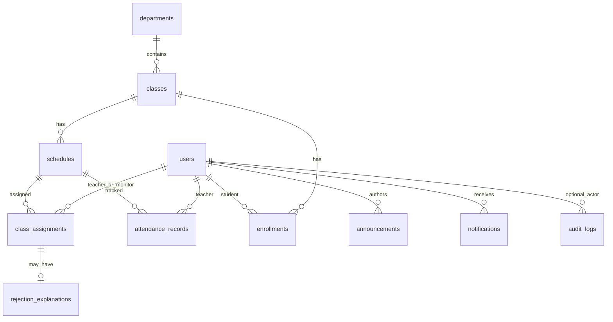

# Entity relationship (summary)

```mermaid
erDiagram
    departments ||--o{ classes : contains
    classes ||--o{ schedules : has
    schedules ||--o{ class_assignments : assigned
    users ||--o{ class_assignments : teacher_or_monitor
    class_assignments ||--o| rejection_explanations : may_have
    schedules ||--o{ attendance_records : tracked
    users ||--o{ attendance_records : teacher
    users ||--o{ enrollments : student
    classes ||--o{ enrollments : has
    users ||--o{ announcements : authors
    users ||--o{ notifications : receives
    users ||--o{ audit_logs : optional_actor
```

See `database/schema.sql` for full keys and constraints.
